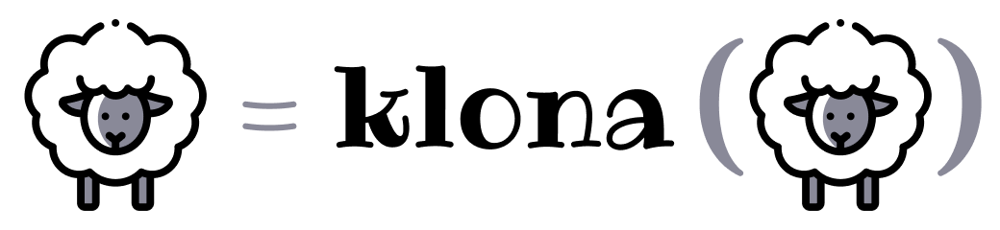

<div align="center">
  
</div>

<div align="center">
  <a href="https://npmjs.org/package/klona">
    
  </a>
  <a href="https://github.com/lukeed/klona/actions">
    
  </a>
  <a href="https://npmjs.org/package/klona">
    
  </a>
  <a href="https://codecov.io/gh/lukeed/klona">
    
  </a>
</div>

<div align="center">A tiny (423B) and fast utility to "deep clone" Objects, Arrays, Dates, RegExps, and more!</div>


## Features

* Super tiny and [performant](#benchmarks)
* Deep clone / recursive copies
* Safely handles complex data types<br>
    _Array, Date, Map, Object, RegExp, Set, TypedArray_

Unlike a "shallow copy" (eg, `Object.assign`), a "deep clone" recursively traverses a source input and copies its _values_ &mdash; instead of _references_ to its values &mdash; into a new instance of that input. The result is a structurally equivalent clone that operates independently of the original source and controls its own values.

Additionally, this module is delivered as:

* **ES Module**: [`dist/index.mjs`](https://unpkg.com/klona/dist/index.mjs)
* **CommonJS**: [`dist/index.js`](https://unpkg.com/klona/dist/index.js)
* **UMD**: [`dist/klona.min.js`](https://unpkg.com/klona)

> **Why "klona"?** It's "clone" in Swedish.<br>
> **What's with the sheep?** [Dolly](https://en.wikipedia.org/wiki/Dolly_(sheep)).


## Install

```
$ npm install --save klona
```


## Usage

```js
import klona from 'klona';

const input = {
  foo: 1,
  bar: {
    baz: 2,
    bat: {
      hello: 'world'
    }
  }
};

const output = klona(input);

// exact copy of original
assert.deepStrictEqual(input, output);

// applying deep updates...
output.bar.bat.hola = 'mundo';
output.bar.baz = 99;

// ...doesn't affect source!
console.log(
  JSON.stringify(input, null, 2)
);
// {
//   "foo": 1,
//   "bar": {
//     "baz": 2,
//     "bat": {
//       "hello": "world"
//     }
//   }
// }
```


## API

### klona(input)
Returns: `typeof input`

Returns a deep copy/clone of the input.


## Benchmarks

> via Node.js v10.13.0

```
Load times:
  fast-clone         0.884ms
  lodash/clonedeep  27.716ms
  rfdc               0.782ms
  clone-deep         4.023ms
  deep-copy          0.513ms
  klona              0.333ms

Validation:
  ✘ JSON.stringify (FAILED @ "initial copy")
  ✘ fast-clone (FAILED @ "initial copy")
  ✔ lodash
  ✘ rfdc (FAILED @ "initial copy")
  ✔ clone-deep
  ✘ deep-copy (FAILED @ "initial copy")
  ✔ klona

Benchmark:
  JSON.stringify   x  36,628 ops/sec ±1.34% (89 runs sampled)
  fast-clone       x  23,518 ops/sec ±1.18% (91 runs sampled)
  lodash           x  33,810 ops/sec ±1.34% (94 runs sampled)
  rfdc             x 181,634 ops/sec ±0.71% (95 runs sampled)
  clone-deep       x  84,558 ops/sec ±0.19% (96 runs sampled)
  deep-copy        x 112,866 ops/sec ±1.26% (94 runs sampled)
  klona            x 220,356 ops/sec ±0.34% (97 runs sampled)
```


## Related

* [dlv](https://github.com/developit/dlv) – safely **read** from deep properties in 120 bytes
* [dset](https://github.com/lukeed/dset) – safely **write** into deep properties in 160 bytes
* [dequal](https://github.com/lukeed/dequal) – safely check for deep equality in 247 bytes


## License

MIT © [Luke Edwards](https://lukeed.com)
